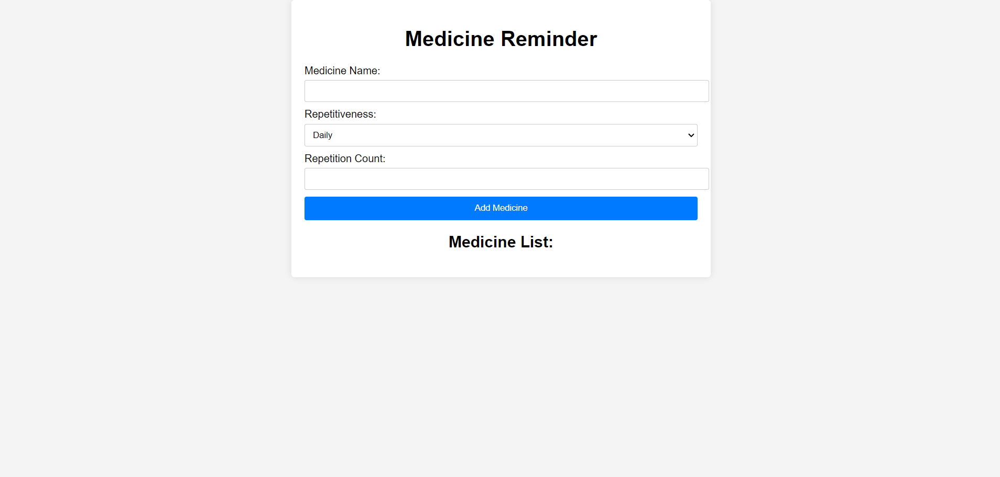
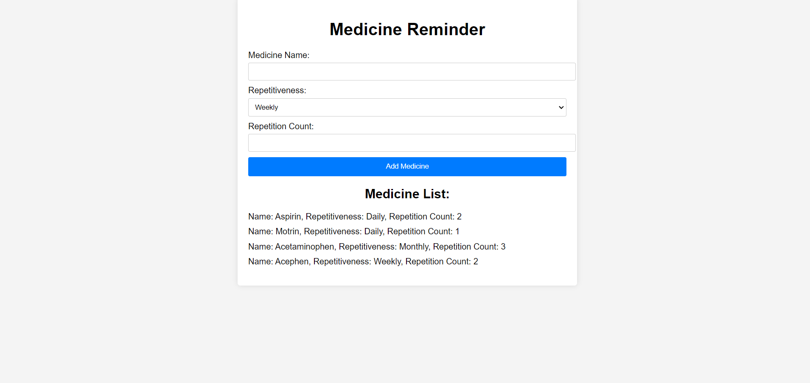

# Medicine Reminder App

A simple web application to help users manage their medicine schedules.

## Features

- Add medicines with their schedules
- View the list of added medicines

## Screenshots

## How to Run

1. Clone this repository: 
git clone https://github.com/your-username/medicine-reminder.git  

2. Navigate to the project directory:
cd medicine-reminder

3. Install dependencies:
npm install

4. Start the server:
node index.js

5. Open your web browser and go to `http://localhost:3000` to view the application.

## Technologies Used

- Node.js
- Express.js
- HTML
- CSS
- JavaScript

## License

This project is licensed under the [MIT License](LICENSE).
